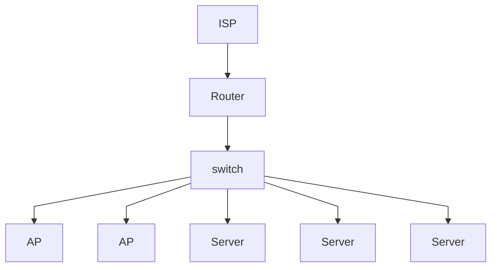

---
# try also 'default' to start simple
theme: default
# apply any windi css classes to the current slide
class: 'text-center'
# https://sli.dev/custom/highlighters.html
highlighter: shiki
# show line numbers in code blocks
lineNumbers: false
# page transition
transition: slide-left
# enable presenter notes
presenter: true
# use UnoCSS
css: unocss
---

# The Home of a Nerd

---

## Core Principals

1. My Family Lives here
2. This is needs to be fun
3. It should be useful

---

## High Level

