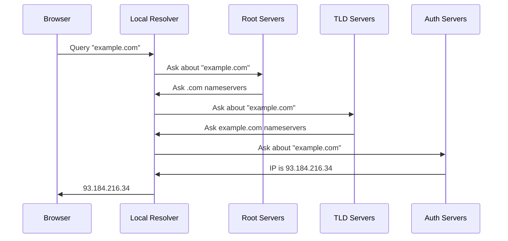
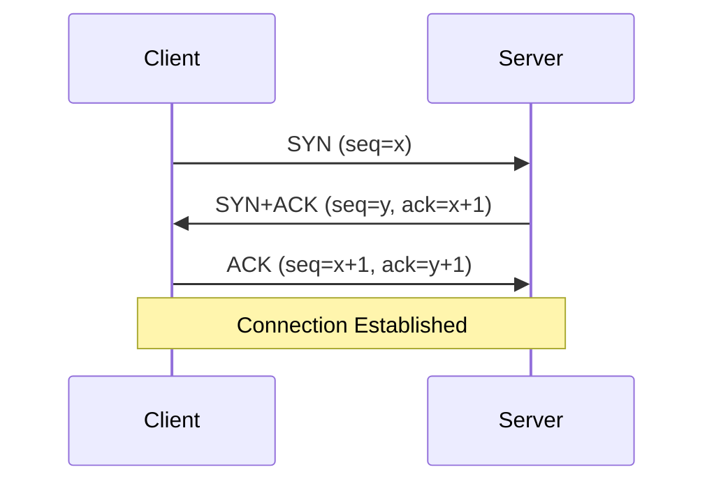
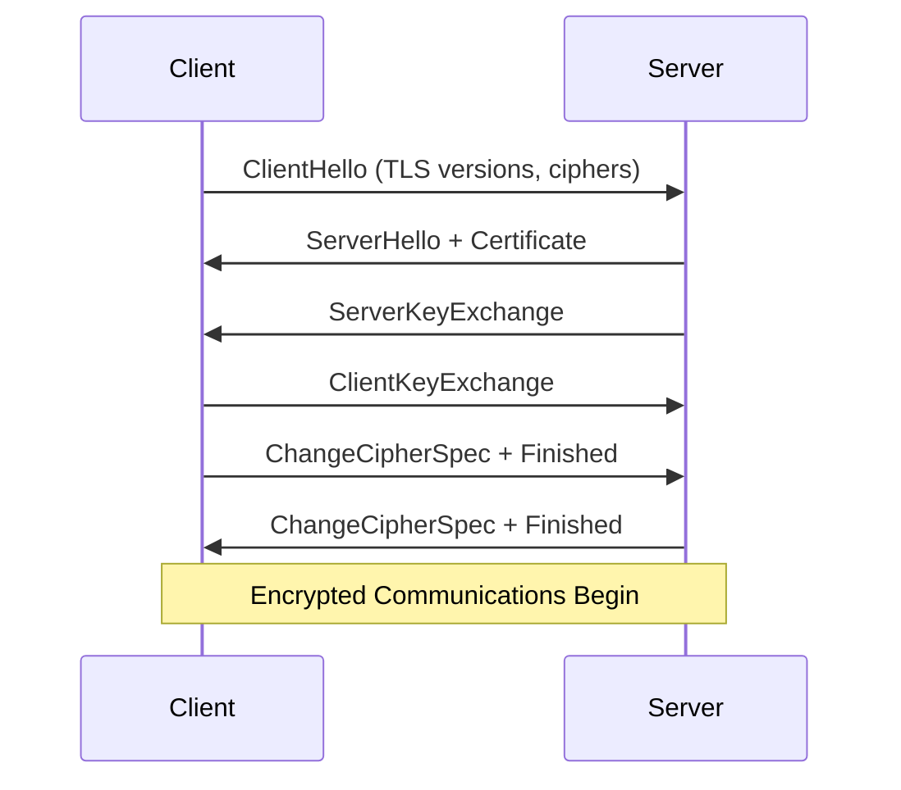
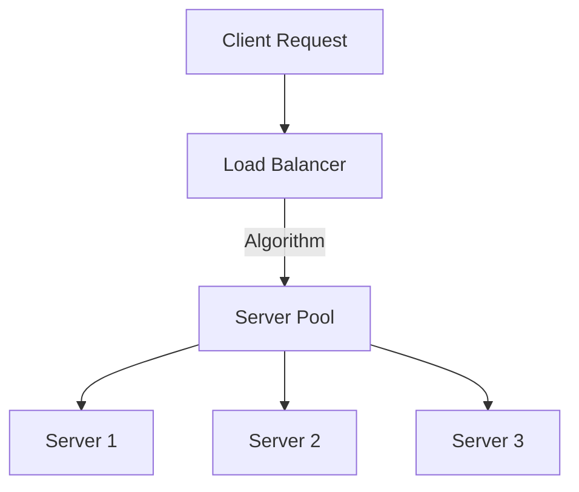
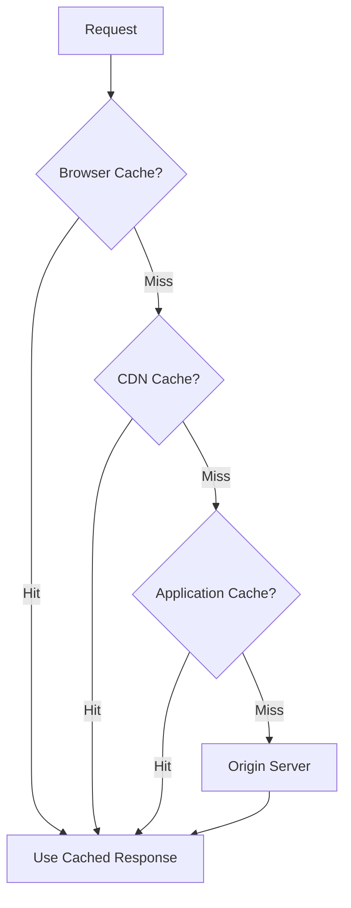

---
# try also 'default' to start simple
theme: default
# apply any windi css classes to the current slide
class: 'text-center'
# https://sli.dev/custom/highlighters.html
highlighter: shiki
# show line numbers in code blocks
lineNumbers: false
# page transition
transition: slide-left
# enable presenter notes
presenter: true
# use UnoCSS
css: unocss
---

# Anatomy of a Web Request

From URL Bar to Response

<!--
This presentation explores the technical journey of an HTTP request from the user's perspective to the server and back, focusing specifically on the aspects most relevant to system administrators.

Key areas covered:
- URL structure and HTTP request formation
- Operating system operations and network stack
- DNS resolution and infrastructure
- Network connection establishment and routing
- TLS encryption and certificate management
- HTTP protocols and security headers
- Server-side processing and configuration
- Load balancing and high availability
- Caching and performance optimization
-->

---
layout: section
---

# The Journey Overview

<!--
We'll walk through these key stages that every web request goes through, highlighting the system administrator's perspective at each stage.
-->

---

## URL Bar to Response: The Complete Path

When you type a URL in your browser:

1. **URL is parsed** into components
2. **HTTP request is formed** with headers and method
3. **Operating system** creates network socket
4. **DNS resolves** the domain name to IP address
5. **Network routing** finds path to server
6. **TCP connection** established with handshake
7. **TLS handshake** secures the connection (for HTTPS)
8. **HTTP protocol** delivers the request
9. **Server processes** the request
10. **Load balancers** may distribute traffic
11. **Caching** may speed up response
12. **Browser renders** the response

---

## The OSI Model & Web Requests

How web requests map to the OSI networking layers:

| Layer | Name | Web Request Components |
|-------|------|------------------------|
| 7 | Application | HTTP, DNS, TLS |
| 6 | Presentation | TLS encryption, data formatting |
| 5 | Session | TLS handshake, TCP connection management |
| 4 | Transport | TCP, port numbers, congestion control |
| 3 | Network | IP routing, packet forwarding |
| 2 | Data Link | Ethernet, MAC addresses, switches |
| 1 | Physical | Network cables, wireless signals |

As a system administrator, you'll primarily work with:
- Layers 7-5: Application configurations
- Layers 4-3: Network tuning and routing
- Layers 2-1: Physical infrastructure management

---

# 1: Understanding URLs

URLs provide the roadmap for web requests:

```
https://example.com:443/path?param=value#section
\_____/ \__________/\_/\____/\_________/\______/
   |         |       |   |        |        |
 scheme    domain  port path    query    fragment
```

- **Scheme**: Protocol (https, http, ftp)
- **Domain**: Server address (hostname)
- **Port**: Connection endpoint (443=HTTPS, 80=HTTP)
- **Path**: Resource location
- **Query**: Parameters for the request
- **Fragment**: Specific document section

---

# 2: HTTP Request Formation

Browser constructs a structured request message:

```http
GET /products/1234 HTTP/1.1
Host: example.com
User-Agent: Mozilla/5.0
Accept: text/html
Cookie: session=abc123
```

- **Method**: Defines action (GET, POST, PUT, DELETE)
- **Path**: Target resource from URL
- **Headers**: Metadata about request and client
- **Body**: Optional data payload (for POST/PUT)

The request structure determines how servers process and respond.


---

# HTTP With bash

```bash
#!/usr/bin/env bash
exec 3<>/dev/tcp/example.com/80

lines=(
  "GET / HTTP/1.1"
  "Host: example.com"
  "User-Agent: curl"
  "Accept: text/html"
  "Connection: close"
  ""
)

printf "%s\r\n" "${lines[@]}" >&3

cat <&3

exec 3>&-
```

---

```
HTTP/1.1 200 OK
Content-Type: text/html
ETag: "84238dfc8092e5d9c0dac8ef93371a07:1736799080.121134"
Last-Modified: Mon, 13 Jan 2025 20:11:20 GMT
Cache-Control: max-age=2314
Date: Wed, 19 Mar 2025 00:31:00 GMT
Content-Length: 1256
Connection: close
X-N: S

<!doctype html>
<html>
<head>
    <title>Example Domain</title>  
</head>

<body>
<div>
    <h1>Example Domain</h1>
</div>
</body>
</html>
```

---

# 3: Operating System Networking

Before leaving your device, requests travel through the OS:

1. **Socket creation** (`socket()` system call)
2. **Connection establishment** (`connect()`)
3. **Data transmission** (`send()/recv()`)

System administrators tune OS parameters:

```bash
# View TCP connection settings
sysctl net.ipv4.tcp_fin_timeout
sysctl net.core.somaxconn

# Monitor active connections
ss -tan state established
```

Critical tuning areas include buffer sizes, connection timeouts, and TCP parameters.

---

# 4: DNS Resolution

Converting domain names to IP addresses:



System administrators handle:

- Resolver configuration (`/etc/resolv.conf`)
- Local DNS caching (dnsmasq, unbound)
- TTL optimization for cache efficiency
- DNSSEC for secure resolution
- Monitoring resolution performance

---

# 5: Network Routing

Data packets travel through multiple network segments:

```
[ Your Device ] → [ Local Router ] → [ ISP ] → 
[ Internet Backbone ] → [ Server's Network ] → [ Server ]
```

System administrators monitor and optimize:

```bash
# Trace route to server
mtr example.com

# View local routing table
ip route show
```

Network considerations include:
- Path optimization and redundancy
- Traffic engineering and prioritization
- MTU settings to prevent fragmentation
- NAT configuration for private networks

---

# 6: TCP Connection

Three-way handshake establishes reliable connection:



TCP provides:
- Reliable, ordered delivery
- Flow control to prevent overwhelming
- Congestion control for network stability

Performance tuning includes optimizing:
- SYN backlog queue size
- Connection timeouts
- Congestion control algorithms
- Socket reuse policies

---

# 7: TLS Handshake

For HTTPS, a secure channel must be established:



Key administrator tasks:
- Certificate deployment and renewal
- Cipher suite configuration
- TLS version policies
- Key security
- Session resumption optimization

---

# 8: HTTP Protocol Operation

Different HTTP versions offer varying capabilities:

- **HTTP/1.1**: Text-based, one request at a time
- **HTTP/2**: Binary, multiplexed, header compression
- **HTTP/3**: QUIC protocol, improved performance

Security headers provide critical protection:

```http
Strict-Transport-Security: max-age=31536000
Content-Security-Policy: default-src 'self'
X-Content-Type-Options: nosniff
X-Frame-Options: DENY
```

These headers defend against XSS, MITM attacks, clickjacking, and more.

---

# 9: Server Processing

Web servers handle requests through several stages:

1. **Connection acceptance** (listen queue)
2. **Request parsing** (headers, method)
3. **Route determination** (which resource)
4. **Resource generation** (static or dynamic)
5. **Response assembly** (status, headers, body)

Nginx configuration example:
```nginx
worker_processes auto;       # CPU cores
worker_connections 1024;     # Concurrent connections
keepalive_timeout 65;        # Connection reuse
gzip on;                     # Compression
client_max_body_size 10M;    # Upload limit
```

---

# 10: Load Balancing

Distributing requests across multiple servers:



Common algorithms:
- **Round Robin**: Equal distribution
- **Least Connections**: To least busy server
- **IP Hash**: Session affinity via client IP
- **Response Time**: To fastest-responding servers

High availability requires redundant load balancers, health checks, and failover mechanisms.

---

# 11: Caching Strategies

Caching reduces load and improves performance:



Caching headers control behavior:
```http
Cache-Control: public, max-age=3600
ETag: "33a64df551425fcc55e4d"
Last-Modified: Wed, 21 Oct 2022 07:28:00
```

Each cache level reduces load on downstream systems.

---

# 12: System Administrator's Toolkit

Essential tools for monitoring and troubleshooting:

**Network Tools**
```bash
dig +trace example.com      # DNS resolution trace
mtr example.com             # Network path analysis
curl -I example.com         # Check HTTP headers
openssl s_client -connect example.com:443  # TLS inspection
```

**Server Tools**
```bash
vmstat 1                    # System resource monitoring
ab -n 100 example.com       # Load testing
tail -f /var/log/nginx/access.log  # Log monitoring
netstat -tupln              # Open port checking
```

---
layout: center
---

# Bringing It All Together

Each stage presents opportunities for:

- **Performance optimization**: Reducing latency, increasing throughput
- **Security hardening**: Protecting data and services
- **Reliability engineering**: Ensuring uptime and availability
- **Scalability planning**: Handling growth and traffic spikes

Understanding the full request journey enables effective:
- Troubleshooting
- Monitoring
- System design
- Capacity planning

---
layout: end
---

# Questions?

The complete journey from URL to response touches many systems.

<!--
This presentation has covered the full lifecycle of a web request from the moment a user enters a URL until the response is displayed. As system administrators, understanding each component of this journey allows for:

1. More effective troubleshooting
2. Optimized performance tuning
3. Better security implementation
4. Informed infrastructure decisions
5. Proactive monitoring and maintenance

The web technology landscape continues to evolve with:
- HTTP/3 and QUIC adoption
- Increased emphasis on edge computing
- Zero-trust security models
- Service mesh architectures
- Serverless and function-as-a-service offerings

Staying current with these technologies while mastering the fundamentals ensures system administrators can build and maintain robust, performant web infrastructure.
-->