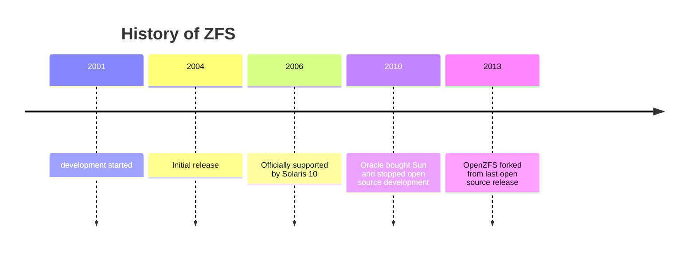
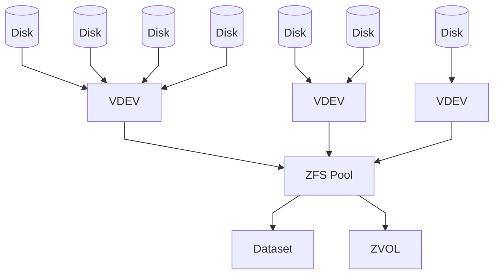
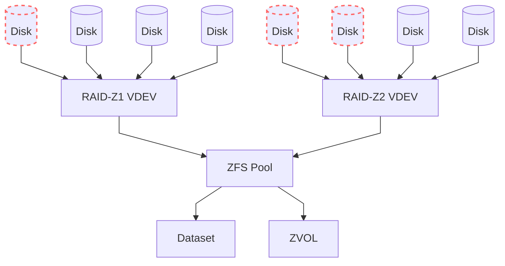

---
# try also 'default' to start simple
theme: default
# apply any windi css classes to the current slide
class: 'text-center'
# https://sli.dev/custom/highlighters.html
highlighter: shiki
# show line numbers in code blocks
lineNumbers: false
# page transition
transition: slide-left
---

# ZFS Intro

Installation, Configuration and Usage

---

# What do you want from a filesystem?
<div class="larger-text">
<v-clicks>

1. Don't eat my data
2. Don't lose my data
3. Allow me to Backup my data easily
4. Allow me to access my data Quickly
5. Keep my data available

</v-clicks>
</div>

<style>
.larger-text {
    font-size: 2em;
}
</style>

---

# What is ZFS?
<div class="larger-text">
<v-clicks>

- An advanced and modern file system.
- ZFS combines file system and volume management capabilities.

</v-clicks>
</div>

<style>
.larger-text {
    font-size: 2em;
}
</style>

---
title: History
---



---

# Features and Benefits
<div class="larger-text">
<v-clicks>

- **Data integrity:** Built-in protection against data corruption.
- **RAID-Z:** Software-based RAID implementation with flexible configurations.
- **Snapshots and clones:** Efficient data backups and virtual copy-on-write.
- **Compression and deduplication:** Space-saving data optimization techniques.
- **Scalability:** Support for large storage capacities.
- **Dynamic striping:** Optimal data distribution across multiple devices.

</v-clicks>
</div>

<style>
.larger-text {
    font-size: 1.3em;
}
</style>

---

# Installation
<Transform :scale="2.0">
<v-clicks>

- BSD
- Linux
- Ubuntu

</v-clicks>
</Transform>
<!--BSD - Installed by default and is the default filesystem on most BSDs

Linux - ZFS is not included in the Linux kernel, but can be installed as a kernel module. Normally some userspace tools are also installed.

Ubuntu - ZFS is included in the kernel and userspace tools can be installed with `apt install zfsutils-linux`-->

---

# License

### OpenZFS
- CDDL (Common Development and Distribution License)
<v-click>

### Linux Kernel
- GPL (GNU General Public License)
</v-click>
<v-click>

## Shared Binary Incompatibility?!
</v-click>

---
layout: full
---

# Overview
<div>

</div>

---

# Data Integrity and Scrubbing
<div class="larger-text">
<v-clicks>

- ZFS ensures data integrity through checksumming.
- Every block is checksummed to detect silent data corruption.
- Scrubbing is a process that checks and repairs data errors.
- Regular scrubbing is essential to maintain data integrity.

</v-clicks>
</div>

<style>
.larger-text {
    font-size: 1.5em;
}
</style>

---

# Snapshots and Clones
<div class="larger-text">
<v-clicks>

- Snapshots are read-only copies of a dataset at a specific point in time.
- Efficiently created and consume no additional space initially.
- Changes made after the snapshot are stored as differences (copy-on-write).
- Clones are writable snapshots that can be used as independent datasets.
- Snapshots and clones are useful for data backup and virtualization.

</v-clicks>
</div>

<style>
.larger-text {
    font-size: 1.5em;
}
</style>

---

# VDEVs
<div class="larger-text">
<v-clicks depth="2">

- Virtual Device
- Vdevs can be combined in various configurations:
  - Mirroring: Data redundancy with multiple copies.
  - RAID-Z1: Software RAID with single disk parity.
  - RAID-Z2: Software RAID with double disk parity.
  - RAID-Z3: Software RAID with triple disk parity.

</v-clicks>
</div>

<style>
.larger-text {
    font-size: 1.5em;
}
</style>

---

# RAID-Z



---

# Datasets

- Partition like
- Can be nested
- Can be mounted

<!--
    Dataset can be thought of like partitions on a disk. They are the basic unit of storage in ZFS.
-->

--- 
lineNumbers: false
---

# Playground
<v-click>

```bash{1-4|3|5-6|7-8}
# Create 4 sparse files
for i in {1..4}; do
    truncate -s 1G /tmp/disk$i
done
# Create a RAID-Z pool
zpool create tank raidz1 /tmp/disk{1..4}
# Check the status
zpool status tank
```

</v-click>
